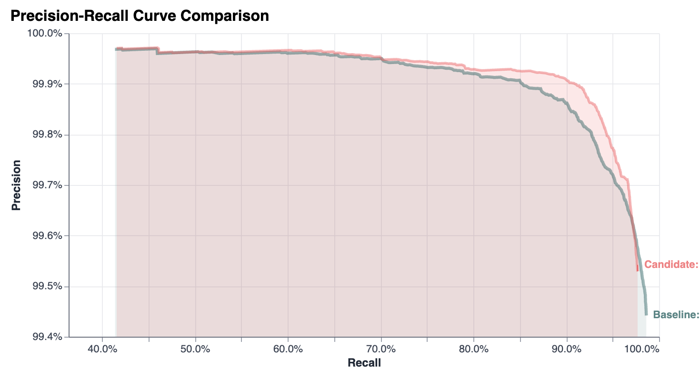

import arithmeticAnnihilationImage from './data_science_age_ai/arithmetic-annihilation-self-play.png';
import distinguishingImage from './data_science_age_ai/distinguishing.png';
import letterEditorImage from './data_science_age_ai/letterpaths-letter-editor.png';
import soundexImage from './data_science_age_ai/soundex-example.png';
import splinkBrowserImage from './data_science_age_ai/splink-javascript-browser.png';

# Data Science in the Age of AI

Data scientists apply the best tools and technology to maximise the value of data.  I’ve been in the profession for over a decade, and in retrospect it’s surprising how slowly things changed over most of that period.  The tools evolved, but ultimately my day-to-day work looked similar in 2013 and 2023.

The rise of LLMs has been the biggest shakeup to the profession that I have experienced.  The work has changed radically.  I used to spend most of my time programming, but in the last year I’ve barely written a single line of code.  Despite this, my coding abilities remain as valuable as ever.

## How our job has changed

How has AI changed our role? [Paraphrasing](https://mrocklin.spicytakes.org/) Matt Rocklin: Our job is now to construct feedback systems that guide AI to good solutions, not to write code ourselves.

Such feedback systems are crucial to the effective use of AI: they make minimising slop and hallucinations more a matter of skill than luck and enable us to trust AI generated code.

Luckily, data scientists are well placed to build these feedback systems because the underlying skills are already familiar:  we already combine data and code to build predictive models, generate and review evidence during model training, and build metrics to quantify how well our models are working.

Let’s take a look at what this looks like in practice, via a series of real-world examples that aim to illustrate the most effective ways I have found to use agents.

In these examples, pay attention to the interplay of two elements that enable the agent to provide feedback to itself:

- How the agent is able to generate new evidence - not in its training data -  usually by running code.
- How the agent verifies it is on the right track

The clearer the evidence, the more likely that verification will be successful.

## Example 1: Profiling code and identifying bottlenecks

My main project is [Splink](http://github.com/moj-analytical-services/splink), a Python library for record linkage that has over 20,000 lines of code.

I gave the agent an open-ended prompt to profile the runtime of Splink code and find optimisations to make the code run faster without changing the results.

I asked it to try different options until it could find one that required only small changes to the code for a large benefit.  It went away for an hour and did the kinds of things I would do: profiling, analysing the flamegraph and identifying issues.

It came back and [found a 25% speedup in the Python](https://github.com/moj-analytical-services/splink/pull/3162) part, with only 15 additional lines of code.

This is the kind of agentic work I like best: a short prompt results in the agent doing lots of work, but then the final outcome is a small, focussed change.

In this example, the evidence being generated by the agent is (1) the results of the profiling and (2) the results of benchmarking to measure speed improvements. The verification is that Splink’s test suite passes.

## Example 2: Upgrading examples and documentation from Splink v4 to v5

We’re working on version 5 of Splink, which is due to be released soon.  We have lots of example code written in the old version that needs upgrading. This is a fiddly task since some code is in snippets in docstrings and Markdown documentation.  I estimate this would have taken over a week of work to do by hand.

In this example I instructed the agent to gather evidence by looking at each PR to Splink v5, so it could generate [a document](https://gist.github.com/RobinL/c6d56a27d8f83c40b6b09643c0fa5d14) summarising the changes needed to the code. I then asked it to use this document as a guide to upgrading the code.

The verification was straightforward: did the code using Splink v5 give the same answer as Splink v4?

## Example 3: Porting code from one language to another

I ported the [DoubleMetaphone function from Apache Commons](https://commons.apache.org/proper/commons-codec/apidocs/org/apache/commons/codec/language/DoubleMetaphone.html?utm_source=chatgpt.com) (Java) to C++ so it can be used in a DuckDB extension. This is straightforward to verify because the Java function has a test suite: we just need to ensure all tests pass.  In addition, I got the agent to generate DoubleMetaphone encodings for thousands of words using the Java function and asked it to verify that the C++ port it wrote gave exactly the same result.

A more impressive demonstration of the power of agents is that I asked one to port Splink to the web browser using DuckDB WASM, something I estimate would have been at least a month’s work.  It was able to do this with fewer than 10 prompts.  You can find the result [here](https://www.robinlinacre.com/splink_in_browser/). Whilst heavily experimental, this is already useful because it provides an interactive GUI for the user to explore the results, which is great for learning about how Splink works.

## Example 4: Simulation

I’ve been building a [two player tower defence game](https://rupertlinacre.com/arithmetic_annihilation/) for my son, with a twist:  to build gun towers and monsters you have to solve mental arithmetic problems.

A key problem in this kind of game is balance.  You don’t want one gun or one strategy to dominate everything else.  But balancing the game is hard, with 7 types of gun, each with 16 upgrades.

I got the agent to gather evidence by playing 1,000 games against itself, calculating statistics on the strength of each gun after each play, and rebalancing until no strategy was completely dominant.

This is another example of my favourite type of agentic work: a simple prompt results in a huge amount of work.  The agent had to build a computer player capable of self-play and then run lots of CPU intensive scripts and analyse the result. But the final change to the game code was tiny: just changing the damage constants on each gun.

## Example 5: Semi-autonomous research

### Learning a new ‘sounds-like’ function

In this example, I used agents to complete a research project to see if we could use machine learning to improve on DoubleMetaphone and Soundex. These are functions widely used in record linkage to identify whether two words with different spellings may sound the same.

These functions need two important properties, as shown in the following image:

- If the names sound the same, the code should match exactly.
- If the names sound different, the code must be different.

The question I had is whether we could learn a new function that would outperform DoubleMetaphone.  Rather than hand coding the rules, the idea was to let the computer optimise them based on data.

I directed the agent to start by collecting as much data as possible on that things sound the same: pairs of words that should share the same code and pairs that should not.  For instance, one source was a machine-readable dictionary with pronunciation guides. The agent could use it to create pairs that ‘sound the same’ and pairs that ‘sound different’. Similarly, I got it to find lists of place names in other countries with different transliterations.

I then set constraints: we were looking to learn a set of rules that could be expressed with simple control logic, expressible in SQL to optimise accuracy.

In about 20 prompts, the agent was able to complete this research project for me, replacing perhaps two or more weeks of human work.  It discovered a function that substantially outperformed Soundex, and marginally outperformed DoubleMetaphone.

In that sense, it was a failure - it was not a sufficient improvement to justify adoption.  But I learned a lot:  that Soundex is a poor classifier compared with DoubleMetaphone, and that there is an upper bound on accuracy due to inherent ambiguity in pronunciation.

### Improving `uk_address_matcher`

A second example of semi-autonomous research involved improving the accuracy of [uk_address_matcher](https://github.com/moj-analytical-services/uk_address_matcher), our free geocoder.

We have hundreds of thousands of rows of labelled data and so every time we come up with an idea for a new feature we can engineer, or a new data cleaning rule, we can ask the agent to do the work for us end to end.

In the example, I wondered whether the concept of ‘[distinguishing tokens](https://www.robinlinacre.com/address_matching/#3--discriminating-tokens-amongst-neighbouring-addresses)’ in an address could be used to improve accuracy.

In this example, I gave the agent the above picture of the concept and a short prompt. It implemented all the logic to derive the feature and then ran our benchmarking suite to determine whether it improved accuracy without reducing inference speed or increasing file size too much.  It resulted in an unambiguous improvement in accuracy, and the PR is [here](https://github.com/moj-analytical-services/uk_address_matcher/pull/444).

This is another nice example of a small valuable change to the code that results from the agent doing a large amount of evidence gathering and verification on our behalf.  I should add that we have done many other similar experiments which have failed!

## Example 6: Letterpaths and putting yourself in the agentic loop

I’ve been working on a cursive handwriting library for my kids that can help power educational apps.  This is a very visual piece of work where everything depends on the shapes of the letters and the joins between them.   LLMs, so far at least, are pretty weak at this.

We can see this by comparing two prompts:  in the first, we ask a frontier model to generate geometry for the word ‘cursive’.  It fails miserably.  The second is the final result of putting a human in the loop.

	<figure>
		
		<figcaption>Bad: LLM only (GPT-5.5)</figcaption>
	</figure>
	<figure>
		<a
			href="https://www.robinlinacre.com/letterpaths/guided_tracing/?word=cursive&offsetArrowLanes=0"
			aria-label="Open the guided tracing demo"
		>
			<video
				autoPlay
				loop
				muted
				playsInline
				preload="metadata"
				poster="/letterpaths_llms_good_even_when_bad/letterpaths_llms_visual-demo-poster.webp"
				style={{ cursor: "pointer" }}
				aria-label="Screen recording showing the letterpaths interface"
			>
				<source src="/letterpaths_llms_good_even_when_bad/letterpaths_llms_visual-demo.webm" type="video/webm" />
				<source src="/letterpaths_llms_good_even_when_bad/letterpaths_llms_visual-demo.mp4" type="video/mp4" />
			</video>
		</a>
		<figcaption>Good: Human in the loop</figcaption>
	</figure>

This image is a pretty good summary of why everything goes wrong if we can’t build verification into our work.

The inability of the LLM to distinguish good images from bad images breaks the agentic loop.  It therefore cannot give itself feedback, and you end up with the slop shown in the LLM-only image.

So the trick is to put the human into the loop as efficiently as possible.  Often we can use AI to reduce the verification work the human has to do to the absolute minimum.  In this example, I built a range of throwaway apps, including a [letter bezier curve editor](https://www.robinlinacre.com/letterpaths/editor.html), [a join analyser](https://www.robinlinacre.com/letterpaths/join_stats/), and [a kerning editor](https://www.robinlinacre.com/letterpaths/kerning_editor/), to put myself in the verification loop. You can read more in [a separate blog post](https://www.robinlinacre.com/letterpaths_llms_good_even_when_bad/).

A second example of putting a human in the loop is using AI to visualise and understand an algorithm, an approach I put to good use in understanding the properties of [fault-tolerant tries](https://www.robinlinacre.com/fault_tolerant_trie/) for address matching.

## The agentic future

Where is all this headed?  The rate of improvement of capabilities means it’s impossible to know long term.

But in the short term - over the next year or two I think the trend will be towards longer running and more numerous agents:

- Cloud agents will become the norm, making it easier to run multiple agents in separate disposable environments.
- This results in a much stronger sandbox, dramatically reducing the need for approvals, and hence allowing long-running autonomous work
- Always-on agents will become more common, triaging bug reports, and conducting long-running research projects such as optimising the accuracy of machine learning models
- Agents will become better at managing memory and context, remembering past experiments, and project conventions and preferences.

The result is that individual data scientist will increasingly be managing a team of agents running simultanously.

## Summing up

I find this all in equal parts worrying and exciting.  But stepping back, programming was always the means rather than the end. The value of data scientists remains in our creativity and judgement: understanding business problems, translating them into technical implementations, and working iteratively with our customers towards better solutions.

As implementation gets cheaper, we will have to accept that the business will legitimately expect us to deliver more, faster.  If the new technical skill is building a tight agentic feedback loop, the bigger-picture skill for data scientists will be to also accelerate the feedback loop with our customers, giving them more valuable products more quickly.

