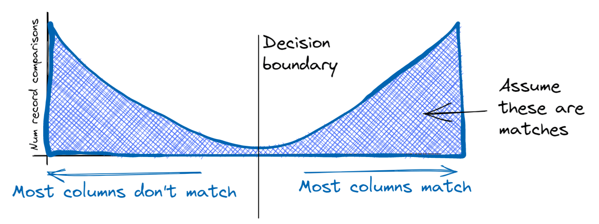

export { MDXLayout as default } from '../components/MDXLayout';
import { SEO } from "../components/SEO"
export const Head = ( props ) => <SEO frontmatter={props.pageContext.frontmatter} />;

import Subtitle from "../components/Subtitle"
import decisionBoundary from "./em_intuition/decision_boundary.png"
import TutorialNav from '../components/TutorialNav';
import CompactTutorialNav from '../components/CompactTutorialNav';

<CompactTutorialNav frontmatter={props.pageContext.frontmatter} />

# The Intuition Behind the Use of Expectation Maximisation to Train Record Linkage Models

<Subtitle>
  How unsupervised learning is used to estimate model parameters in Splink
</Subtitle>

[Splink](http://github.com/moj-analytical-services/splink) is a free probabilistic record linkage library that predicts the likelihood that two records refer to the same entity. For example, what is the probability that the following two records match?

| first_name | surname | dob        | city       | email                   |
| ---------- | ------- | ---------- | ---------- | ----------------------- |
| lucas      | smith   | 1984-01-02 | London     | lucas.smith@hotmail․com |
| lucas      | smith   | 1983-02-12 | Manchester | lucas.smith@hotmail․com |

The underlying statistical model is called the Fellegi Sunter model. It works by computing partial match weights, which are a measure of the importance of the different columns in computing the probability of a match. For example, the match on ‘Smith’ is less important than the match on email in the above example.

However, there’s a paradox at the heart of the problem of training a record linkage model: To estimate the parameters of the model, you need to know which records match. But finding which records match is the whole problem you’re trying to solve. Manual labelling of comparisons is error prone and costly so isn’t a great option.

The Expectation Maximisation (EM) algorithm provides a solution to this paradox. This post provides an intuitive explanation for how this works, and some details of how it’s implemented in [Splink](https://github.com/moj-analytical-services/splink), our software for record linkage at scale. For a more formal treatment, see the[ FastLink paper.](https://imai.fas.harvard.edu/research/files/linkage.pdf)

## The EM Approach

The parameters of a record linkage model — the m and the u probabilities — can be calculated from the aggregate characteristics of matching records and non-matching records respectively. (For a fuller treatment of m and u probabilities, I recommend reading [this blog post](https://www.robinlinacre.com/maths_of_fellegi_sunter/).) Once these values are known, the model is usually able accurately to predict which records match.

The key to the EM approach is leveraging the fact that matching and non-matching record comparisons form two fairly distinct ‘clusters’:

- Amongst matching record comparisons, the information in most or all columns in the two records usually matches.

- Amongst non-matching record comparisons, the information in most or all columns in the two records usually does not match

This results in a bimodal distribution of record comparisons:

This separation between matches and non-matches means it’s relatively easy to come up with a rough decision rule that is able to correctly identify most matches and most non-matches. For instance, we could simply count the number of columns that match (first name surname, and so on), and predict a match for any record pair where more than half of them match.

This is fundamental to resolving our paradox: We've just found a way to designate matches and non matches without any labeled data (i.e. unsupervised learning).

Now that we have designated each record comparison as a match or a non match, we can use this information to estimate the implied m and u parameters of the model. And this enables us to iteratively improve this decision rule, using the following algorithm:

**Expectation step:** Use the estimated model parameters to predict which record comparisons are matches

**Maximisation step:** Use the predictions to re-estimate the model parameters

In this example, our initial decision rule worked by simply counting the number of columns with matching information. As such, we gave equal weight to every column. Clearly there is room for improvement in this rule — in reality a match on a postcode column is more important than a match on gender.

In the first maximisation step, the expectation maximisation process will immediately begin to learn these weights. For example, it will recognise that, amongst non-matches there are many record comparisons which match on gender, but few that match on postcode. This will be represented in the re-computed m and u probabilities, and in the next iteration, greater weight will be placed on a match on postcode than gender.

At each iteration, the decision rule will be refined as the model makes fewer mistakes, and the weights therefore become more accurate.

Convergence occurs when the parameter estimates stabilise, and there are no longer any changes to parameter estimates between iterations.

It turns out this algorithm is equivalent to maximising the likelihood function of the Fellegi-Sunter model (although note that it is only guaranteed to converge to a local maxima, not necessarily a global one).

## A caveat around the decision boundary

In the above, to build intutiion, I describe concrete decision boundary that classifies each record comparison as either a match or a non match. The m and u values calculated in the maximisation step are based on the counts of matches and non-matches that result from this binary classifier.

In reality, we can improve on this, because using a decision boundary throws away some of the information in the match probability: it treats an uncertain match in the same way as a highly probable match.

There's a simple modification to the methodology that accounts for this. We can use the match probability directly, rather than applying the decision bondary. For example, if a record comparison has a 70% match probability, in the maximisation step this can be treated as 0.3 non-matching records and 0.7 matching records. So when the m and u probabilities are recomputed in the maximisation step, we use the sum of probabilities rather than counts of matches and non matches.

## How the EM approach is implemented in Splink

In Splink, a few modifications to the above process are made that, in practice, result in faster convergence and a greater likelihood of convergence to a global maxima.

### Estimating the u probabilities

Whilst it is possible to estimate u probabilities using the EM approach, we recommend an [alternative estimation procedure](https://moj-analytical-services.github.io/splink/linker.html#splink.linker.Linker.estimate_u_using_random_sampling) in Splink which is usually more accurate.

Recall that the u probabilities represent the probability that we observe matching columns amongst truly non-matching records. For example, how often do we observe the coincidence that two different people have the same first name?

We can estimate the u probabilities by taking random pairwise record comparisons, assuming they do not match, and computing how often these coincidences occur. Since the probability of two random records being a match (representing the same entity) is usually very low, then this will yield good estimates of u values.

An additional benefit of this approach is that if the u probabilities are correct, it ‘anchors’ the EM estimation procedure and greatly improves the chance of it converging to a global, rather than local, maximum.

### Starting values and the initial decision boundary

In the above, we suggested a simple decision rule for the first step of EM: count the number of matching columns, and designate as a match any comparison where more than half of fields match.

In reality, it’s possible to begin with a decision rule which is usually more accurate, leading to faster convergence. Specifically, the initial decision rule uses the u probabilities that have been estimated using the random sampling procedure described above, and ‘sensible default’ starting values for the m probabilities .

You can see all of this at work in practice in some of our [example notebooks](https://moj-analytical-services.github.io/splink/examples_index.html).

## Conclusion

EM is a powerful tool for estimating the parameters of probabilistic linkage models in the Fellegi Sunter framework. In our experience, the EM approach works best when it is used to estimate the m probabilities of the model only, following estimation of the u probabilities using random sampling, and estimating the [prior](https://moj-analytical-services.github.io/splink/settings_dict_guide.html#probability_two_random_records_match) using a [direct estimation techique](https://moj-analytical-services.github.io/splink/linkerest.html#splink.linker.Linker.estimate_probability_two_random_records_match).

<TutorialNav frontmatter={props.pageContext.frontmatter} />